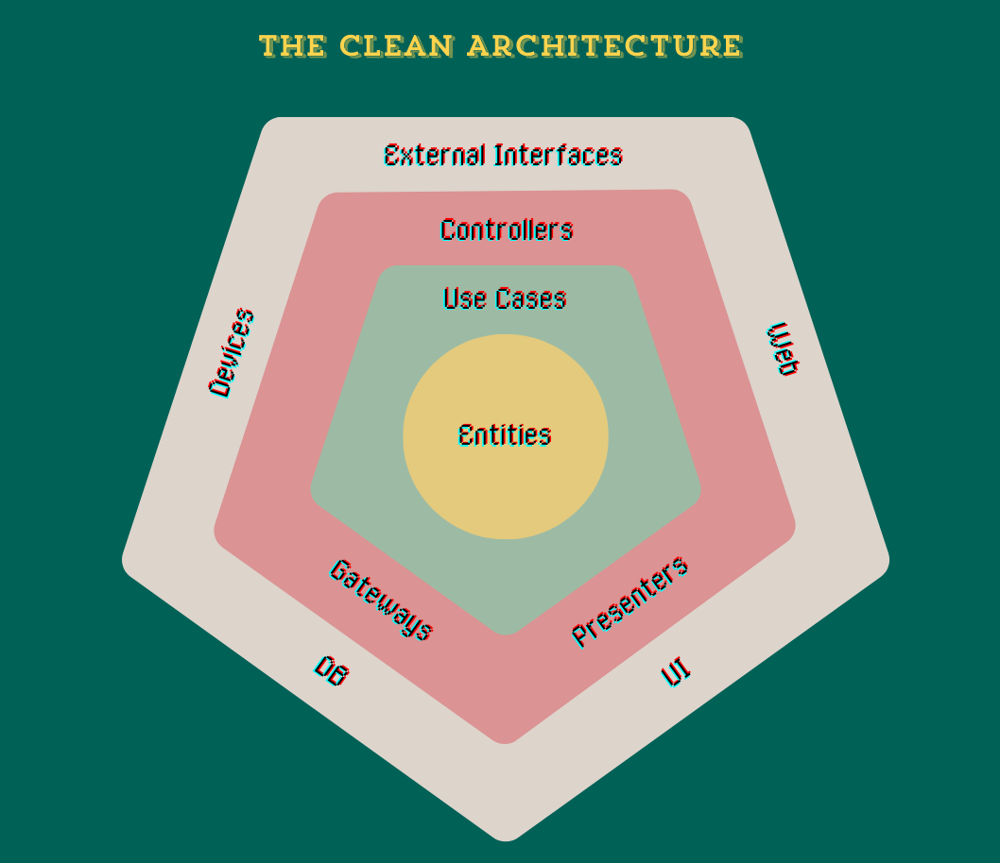

<h1 align="center">OfficeAttendance</h1>
<div align="center">
  <strong>Making it easy to catch up with your mates during hybrid times</strong>
</div>
<div align="center">
  <em>With a Clean Architecture twist</em>
</div>

<br />

<div align="center">

[](https://shields.io/)
[](https://docker.com/)
[](https://shields.io/)
[](https://shields.io/)
[](https://GitHub.com/Naereen/StrapDown.js/commit/)
[](https://github.com/ellerbrock/open-source-badges/)

</div>

<div align="center">
  <h3>
   <a href="https://nicolasbracigliano.com/bit-acora/clean-architecture-building-software-that-lasts/">
      Clean Architecture
   </a>
   <!-- <span> ♦ </span>
    <a href="https://nicolasbracigliano.com/bit-acora/from-chaos-to-clarity-mastering-c4-diagrams-for-software-architecture/">
      C4 Diagrams
    </a> -->
    </h3>
</div>

<div align="center">
  <sub>Built with ❤︎ by
  <a href="https://nicolasbracigliano.com/about">Nicolas Bracigliano</a>
</div>

## Table of Contents

- [Summary](#summary)
- [Philosophy](#philosophy)
- [Architecture](#architecture)
- [Project Structure](#project-structure)
- [Setup](#setup)
- [Testing](#testing)
- [Usage](#usage)


## Summary

The **Office Attendance** is a tool for announcing employee attendance in an hybrid office setting. This API allows you to track and record employee check-ins, generate attendance reports to have an idea when that person that you want to see in person will be going to the office.
The project is built with a focus on Clean Architecture principles, ensuring separation of concerns, testability, and maintainability. It leverages .NET technologies and follows industry best practices such as Test-Driven Development (TDD).

## Philosophy

This project is built on the foundations of Clean Architecture, Test-Driven Development (TDD), and a strong commitment to best practices in software development. Writing clean code and adhering to these principles not only ensures high-quality work but also makes life easier for your future self and colleagues.

> 🌱  
> I believe that if you want your future self and your colleagues to appreciate your work, writing clean code and following best practices will set you on the right path.

### Clean Architecture

Clean Architecture, as advocated by Robert C. Martin (Uncle Bob), emphasizes the importance of separating the various layers of a software system to improve its modularity and scalability. The core of the application (domain entities, use cases) is kept independent of external frameworks, UI, or databases. This approach allows the application to be more adaptable to changes and easier to test.
If you want to learn more about Clean Architecture, check out my blog post where I cover this topic.

> 💡  
> If you want to learn more about Clean Architecture, check out my **[blog post](https://nicolasbracigliano.com/bit-acora/clean-architecture-building-software-that-lasts/)** where I cover this topic.


### Test-Driven Development (TDD)

TDD is a development methodology where tests are written before the code that fulfils the requirements. This ensures that the software design is guided by tests, resulting in higher code quality, fewer bugs, and a clearer understanding of the software's behaviour.

## Architecture

<p align="center"></p>
The project is structured according to Clean Architecture principles, dividing the codebase into distinct layers:

- **Core Layer**: Contains the business logic and domain entities, which are agnostic of external systems.
- **Application Layer**: Coordinates the application's use cases, interacting with the core layer and external interfaces.
- **Infrastructure Layer**: Implements the details of data persistence, repositories, and external services.
- **API Layer**: Provides the entry point for the application, exposing the necessary endpoints and managing user interactions.

This separation ensures that each layer has a clear responsibility, making the system more maintainable and scalable.

## Project Structure

The **OfficeAttendance** solution is composed of five distinct projects, each serving a specific role within the overall architecture. This separation reinforces the principles of Clean Architecture by ensuring clear boundaries and preventing illegal dependencies between layers.

### Projects Overview

- **`OfficeAttendance.Application`**: This project contains the application logic, including Data Transfer Objects (DTOs) and use cases. It is responsible for coordinating the application workflows and interacting with the core domain models while remaining agnostic of the underlying infrastructure and external interfaces.

- **`OfficeAttendance.Core`**: The core domain models and interfaces are housed in this project. It defines the essential business rules and entities that are central to the application. This project is entirely independent of any external frameworks or libraries, adhering to the Clean Architecture principle of keeping the core pure and isolated.

- **`OfficeAttendance.Infrastructure`**: This project is responsible for data persistence and the implementation of repository patterns. It provides the necessary infrastructure to interact with external systems like databases, ensuring that the core and application layers remain decoupled from these concerns.

- **`OfficeAttendance.Tests`**: This project contains unit tests that validate the behaviour of the application. By isolating the tests in a separate project, the codebase remains clean and the tests can be maintained independently from the application code.

- **`OfficeAttendance.WebAPI`**: Serving as the main entry point for the application, this project includes the WebAPI controllers and configuration files. It exposes the necessary endpoints for external interactions and manages the HTTP request/response lifecycle.

### Project Separation and Dependency Management

The separation of these projects enforces a strict adherence to Clean Architecture principles by defining clear references between the layers. Each project can only reference the projects directly below it in the dependency hierarchy:

- **`OfficeAttendance.WebAPI`** depends on **`OfficeAttendance.Application`** and **`OfficeAttendance.Infrastructure`**.
- **`OfficeAttendance.Application`** depends on **`OfficeAttendance.Core`**.
- **`OfficeAttendance.Infrastructure`** also depends on **`OfficeAttendance.Core`**.
- **`OfficeAttendance.Tests`** can depend on any project but typically focuses on **`OfficeAttendance.Core`**, **`OfficeAttendance.Application`**, and **`OfficeAttendance.Infrastructure`** for unit testing.

This structure ensures that there are no illegal interactions or dependencies, maintaining the integrity of the architecture and making the system more maintainable and testable.

## Setup

### Prerequisites

- .NET 8.0 SDK or later
- Docker (if running the application in a containerized environment)

### Installation

1. Clone the repository:
   ```bash
   git clone https://github.com/nicolas-E1/OfficeAttendance.git
   cd officeAttendance
   ```

2. Restore the dependencies:
   ```bash
   dotnet restore
   ```

3. Build the project:
   ```bash
   dotnet build
   ```

### Configuration

Configure the application settings by modifying the `appsettings.json` file located in the `OfficeAttendanceAPI` project. This file includes configurations for the database connection, logging, and other settings.

### Running the Project Locally

To run the project locally:

1. Use the following Makefile command:
   ```bash
   make run
   ```

2. Alternatively, you can run the API directly using the .NET CLI:
   ```bash
   dotnet run --project OfficeAttendance.WebAPI
   ```

### Running the Project with Docker

To run the application in a Docker container:

1. The first time run this command to run the migrations
   ```bash
   make all
   ```
   
   Then you can use this to just spin up the containers
    ```bash
   make up
   ```

   Alternatively, you can use this run the migrations
    ```bash
   make migrations
   ```

2. To check the containers logs run the following command
   ```bash
   make logs
   ```

3. To stop the container run
   ```bash
   make down
   ```

## Testing

### Unit Tests

The project follows a TDD approach, with unit tests written to validate the behaviour of the application. The tests are located in the `OfficeAttendance.Tests` project.

To run the tests with coverage reports use:
```bash
make test
```
Alternatively, you can run the tests with:
```bash
dotnet test
```

### Integration and Contract Testing

While the current setup only includes unit tests, integration tests and contract testing will be added in future iterations to ensure that the application works seamlessly with external systems and meets the specified contracts.

## Usage

Once the container is up and running, you can start making API requests to manage employee attendance. The application provides several endpoints to interact with the system. Below are some examples of how to use the API:

### Example API Requests

- **Retrieve attendance report for a particular day:**
    ```http
    GET /attendance/reports/attendance/2024-05-25
    ```
    This endpoint returns the attendance records for the specified date.

- **Retrieve attendance report for the current week:**
    ```http
    GET /attendance/reports/week
    ```
    This endpoint provides a summary of attendance for the current week.

### API Documentation

The application also supports **Swagger**, an interactive API documentation tool that allows you to explore and test the endpoints directly from your browser. To access the Swagger UI, navigate to the following URL once the application is running:

- When running with Docker: `http://localhost:5555/swagger/`
- When running locally: `http://localhost:5000/swagger/`

In Swagger, you can view detailed documentation for each endpoint, including the expected request parameters, response formats, and possible error codes. This makes it easier to understand how to interact with the API and integrate it with other systems.

## Additional Notes

This project is a demonstration of clean coding principles and architectural patterns. It is not yet production-ready, and further enhancements and optimisations are required before deployment in a live environment.
